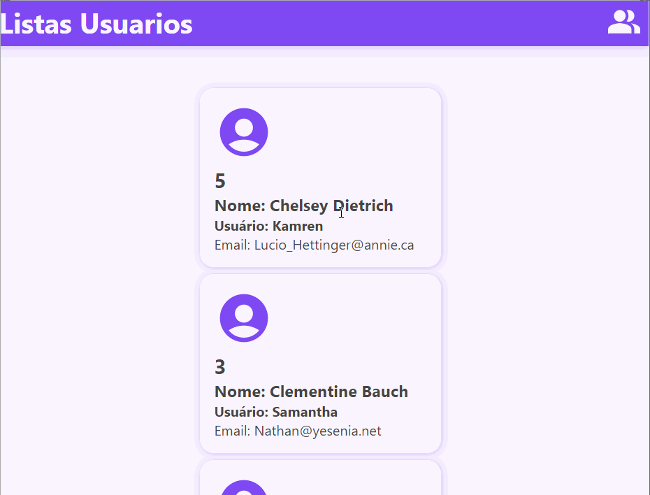
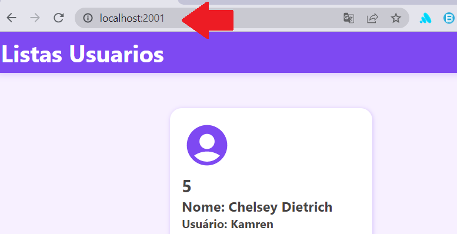

# TestUserApi ➡️

### Indice 🗂️

1. Introdução
2. Tech usadas
3. Como Instalar
4. Como Usar
5. Licença

### Introdução 🚪

Este é o projeto para consumo APIs, cujo o objetivo buscar 5 usuários, lista-los em ordem alfabética em seguida através de uma API GATEWAY como middleware de consumo para o front-end.

### Tech Usadas 🦾

### Como Instalar 🧑‍🔧

1. Tenha o node instalado em seu PC
2. Faça o clone do projeto
3. Entre na pasta **backend**
4. Digite um **npm install** para baixa todas as dependências.
5. Digite um **npm run prod** para iniciar a aplicação.

### Como usar 🙇‍♂️

1. Entre em um navegador
2. Digite na barra de pesquisa o endereço a seguir adiante: [http://localhost:2001/](http://localhost:2001/users/) ou endereço junto com a porta que você selecionou.

1. Assim a aplicação estará rodando normalmente.

### Autor
---
 
  
 <b>Joao Guilherme</b></a> <a href="https://github.com/JoaoG23/">🚀</a>

Feito com 🤭 por Joao Guilherme 👋🏽 Entre em contato!

 

### **Licença**

